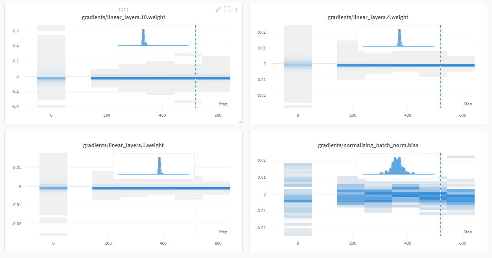
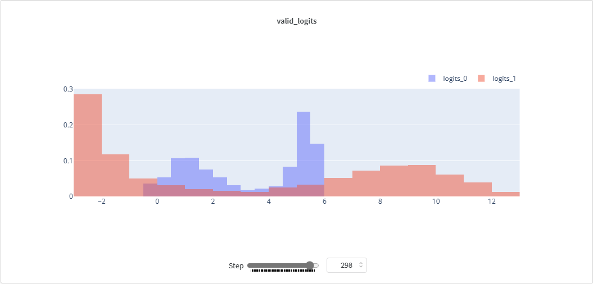

Experiment Tracking is almost an essential part of machine learning. It is critical in upholding reproduceability. PyTorch Tabular embraces this and supports experiment tracking internally. Currently, PyTorch Tabular supports two experiment Tracking Framework:

1. Tensorboard
1. Weights and Biases

Tensorboard logging is barebones. PyTorch Tabular just logs the losses and metrics to tensorboard. W&B tracking is much more feature rich - in addition to tracking losses and metrics, it can also track the gradients of the different layers, logits of your model across epochs, etc.

## Basic Usage

- `project_name`: str: The name of the project under which all runs will be logged. For Tensorboard this defines the folder under which the logs will be saved and for W&B it defines the project name
- `run_name`: str: The name of the run; a specific identifier to recognize the run. If left blank, will be assigned a auto-generated name based on the task.
- `log_target`: str: Determines where logging happens - Tensorboard or W&B. Choices are: `wandb` `tensorboard`. Defaults to `tensorboard`

### Usage Example

```python
experiment_config = ExperimentConfig(project_name="MyAwesomeProject", run_name="my_cool_new_model", log_target="wandb")
```

## Advanced Usage

### Track Gradients

It is a good idea to track gradients to monitor if the model is learning as it is supposed to. There are two ways you can do that.

1. `exp_watch` parameter in `ExperimentConfig` can be set to `"gradients"` and choose `log_target` as `"wandb"`. This will track a histogram of gradients across epochs.



2. You can also set `track_grad_norm` to `1` or `2` for L1 or L2 norm of the gradients. This works for both Tensorboard ad W&B.


### Track Logits

Sometimes, it also helps to track the Logits of the model. As training progresses, the Logits should become more pronounced or concentrated around the target that we are trying to model.

This can be done using the parameter `log_logits` in `ExperimentConfig`.




::: pytorch_tabular.config.ExperimentConfig
    options:
        show_root_heading: yes
