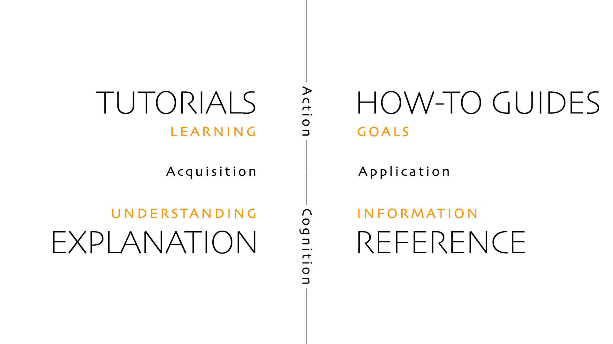

**PyTorch Tabular** is a powerful library that aims to simplify and popularize the application of deep learning techniques to tabular data. Tabular deep learning has gained significant importance in the field of machine learning due to its ability to handle structured data, such as data in spreadsheets or databases. However, working with tabular data can be challenging, requiring expertise in both deep learning and data preprocessing. 

This is where **PyTorch Tabular** comes in. Built on the shoulders of giants like `PyTorch`, `PyTorch Lightning`, and `pandas`, PyTorch Tabular offers a **low resistance usability**, making it accessible to both real-world use cases and research projects. The library's core principles revolve around **easy customization**, allowing users to tailor their models and pipelines to specific requirements. Moreover, PyTorch Tabular provides **scalable and efficient tooling**, making it easier to deploy models in production environments. The underlying goodness of `PyTorch` makes designing deep learning architectures pythonic and intuitive, while `PyTorch Lightning` simplifies the training process. `pandas` is the de-facto standard for working with tabular data, and PyTorch Tabular leverages its strengths to simplify the preprocessing of tabular data. With PyTorch Tabular, data scientists and researchers can focus on the core aspects of their work, while the library takes care of the underlying complexities, enabling efficient and effective tabular deep learning.

The documentation is organized taking inspiration from the Diátaxis system of documentation. 

> Diátaxis is a way of thinking about and doing documentation. Diátaxis identifies four distinct needs, and four corresponding forms of documentation - tutorials, how-to guides, technical reference and explanation. It places them in a systematic relationship, and proposes that documentation should itself be organised around the structures of those needs. Diátaxis solves problems related to documentation content (what to write), style (how to write it) and architecture (how to organise it). It is a system for thinking about documentation, and a system for doing documentation. - [Diátaxis](https://diataxis.fr/)

Taking cues from the system, the documentation is separated into five sections:

- **Getting Started** - A quick introduction on how to install and get started with PyTorch Tabular.

- **Tutorials** - Short and focused exercises to get you going quickly.

- **How-to Guides** - Step-by-step guides to covering key tasks, real world operations and common problems.

- **Concepts** - Explanations of some of the larger concepts and intricacies of the library.

- **API Reference** - The technical details of the library: all classes and functions, along with their parameters and return types.
