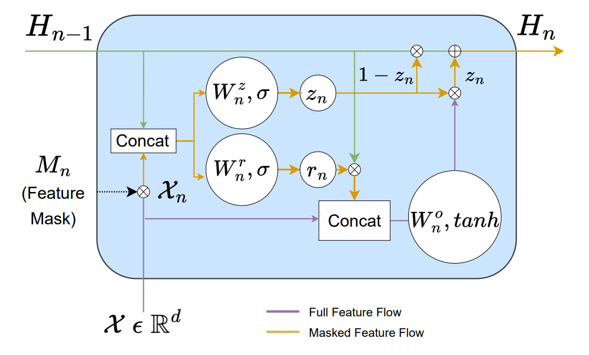
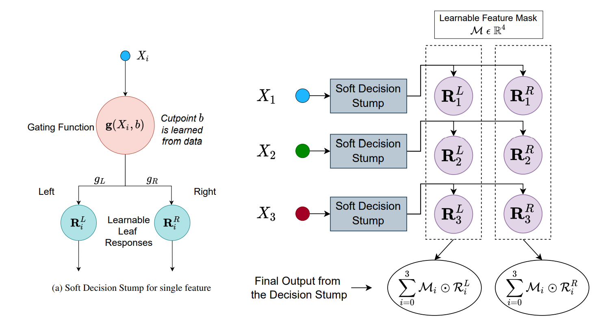
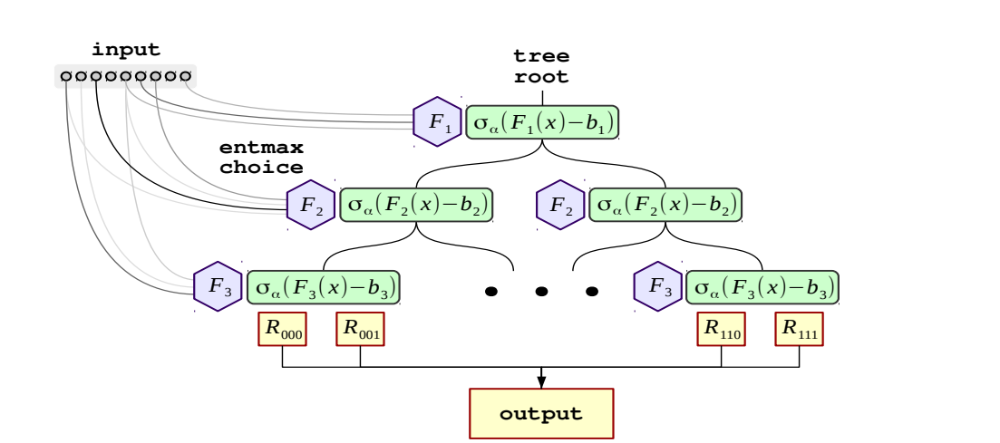
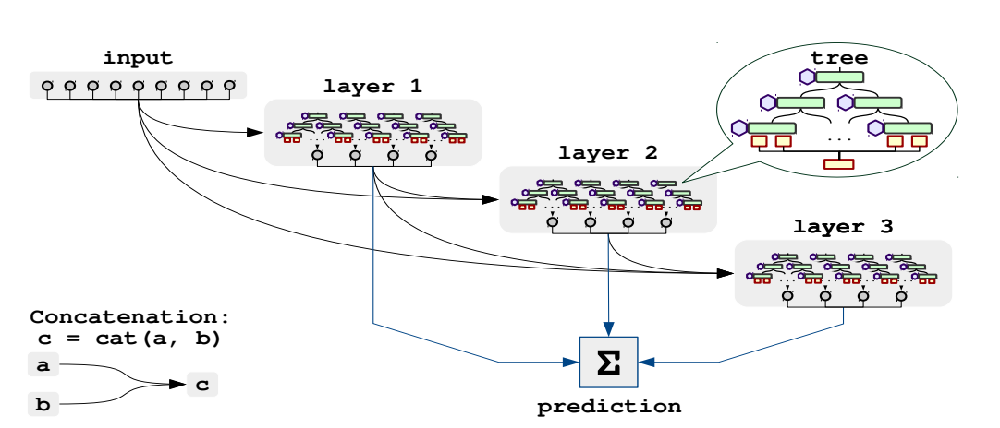
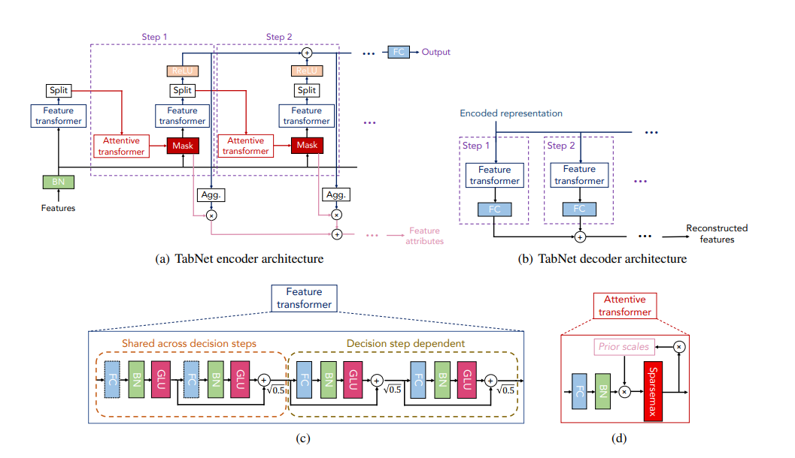
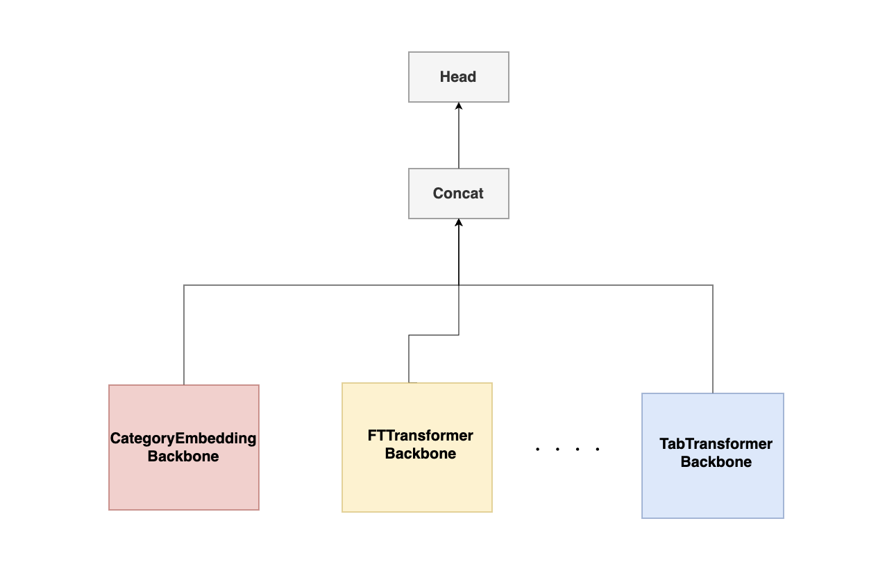

Choosing which model to use and what parameters to set in those models is specific to a particular dataset. In PyTorch Tabular, a model has three components:

1. Embedding Layer - This is the part of the model which processes the categorical and continuous features into a single tensor.
1. Backbone - This is the real architecture of the model. It is the part of the model which takes the output of the embedding layer and does representation learning on it. The output is again a single tensor, which is the learned features from representation learning.
1. Head - This is the part of the model which takes the output of the backbone and does the final classification/regression. The output of the head is the final prediction.

We can choose the embedding layer, backbone, and head and their parameters using the model specific config classes.

## Common Configuration

While there are separate config classes for each model, all of them share a few core parameters in a `ModelConfig` class.

- `task`: str: This defines whether we are running the model for a `regression`, `classification` task, or as a `backbone` model. `backbone` task is used in Self-Supervised models and in Mixed Density Models.

**Head Configuration**

- `head`: Optional\[str\]: The head to be used for the model. Should be one of the heads defined in `pytorch_tabular.models.common.heads`. Defaults `LinearHead`.
- `head_config`: Optional\[Dict\]: The config as a dict which defines the head. If left empty, will be initialized as default linear head.

**Embedding Configuration**

- `embedding_dims`: Optional\[List\]: The dimensions of the embedding for each categorical column as a list of tuples (cardinality, embedding_dim). If left empty, will infer using the cardinality of the categorical column using the rule `min(50, (x + 1) // 2)`
- `embedding_dropout`: float: Dropout to be applied to the Categorical Embedding. Defaults to 0.0
- `batch_norm_continuous_input`: bool: If True, we will normalize the continuous layer by passing it through a BatchNorm layer before combining with the categorical embeddings. Defaults to True

**Other Configuration**

- `learning_rate`: float: The learning rate of the model. Defaults to 1e-3.

- `loss`: Optional\[str\]: The loss function to be applied. By Default, it is MSELoss for regression and CrossEntropyLoss for classification. Unless you are sure what you are doing, leave it at MSELoss or L1Loss for regression and CrossEntropyLoss for classification

- `metrics`: Optional\[List\[str\]\]: The list of metrics you need to track during training. The metrics should be one of the functional metrics implemented in `torchmetrics`. By default, it is `accuracy` if classification and `mean_squared_error` for regression

- `metrics_prob_input`: Optional\[List\[bool\]\]: Is a mandatory parameter for classification metrics defined in the config. This defines whether the input to the metric function is the probability or the class. Length should be same as the number of metrics. Defaults to None.

- `metrics_params`: Optional\[List\]: The parameters to be passed to the metrics function

- `target_range`: Optional\[List\]: The range in which we should limit the output variable. Currently ignored for multi-target regression. Typically used for Regression problems. If left empty, will not apply any restrictions

- `virtual_batch_size`: Optional\[int\]: If not None, all BatchNorms will be converted to GhostBatchNorm's with this virtual batch size. Defaults to None

- `seed`: int: The seed for reproducibility. Defaults to 42

All the implemented models and most of the common parameters have intelligent defaults that you will be able to start using the models with a simple:

```python
model_config = <ModelSpecificConfig>(task="classification")
```

That's it, Thats the most basic necessity. All the rest is intelligently inferred or set to intelligent defaults.

## Advanced Usage:

### Learning Rate, Loss and Metrics

Adam Optimizer and the `learning_rate` of 1e-3 is a default that is set in PyTorch Tabular. It's a rule of thumb that works in most cases and a good starting point which has worked well empirically. If you want to change the learning rate(which is a pretty important hyperparameter), this is where you should. There is also an automatic way to derive a good learning rate which we will talk about in the TrainerConfig. In that case, Pytorch Tabular will ignore the learning rate set through this parameter

Another key component of the model is the `loss`. Pytorch Tabular can use any loss function from standard PyTorch([`torch.nn`](https://pytorch.org/docs/stable/nn.html#loss-functions)) through this config. By default, it is set to `MSELoss` for regression and `CrossEntropyLoss` for classification, which works well for those use cases and are the most popular loss functions used. If you want to use something else specficaly, like `L1Loss`, you just need to mention it in the `loss` parameter

```python
loss = "L1Loss
```

PyTorch Tabular also accepts custom loss functions (which are drop in replacements for the standard loss functions) through the `fit` method in the `TabularModel`.

!!! warning

    **If you do not know what you are doing, leave the loss functions at default values.** Models return the raw logits and it is the responsibility of the Loss function to apply the right activations.

While the Loss functions drive the gradient based optimization, we keep track of the metrics that we care about during training. By default, PyTorch Tabular tracks Accuracy for classification and Mean Squared Error for regression. You can choose any functional metrics (as a list of strings) from [TorchMetrics](https://torchmetrics.readthedocs.io/en/stable/references/metric.html).

Some metrics need some parameters to work the way we expect it to. For eg. the averaging scheme for a multi-class f1 score. Such parameters can be fed in through `metrics_params`, which is a list of dictionaries holding the parameters for the metrics declared in the same order. In classification metrics, PyTorch Tabular also needs to know whether the metric defined expects the predicted class (like Accuracy) or the predicted probability (like ROCAUC). This can be specified by `metrics_prob_input` which is a list of `True` or `False`, one for each custom metric you define.  Length of `metrics_params`, `metrics_prob_input` and `metrics` should be the same.

```python
metrics = ["accuracy", "f1_score"]
metrics_prob_input = [False, False]
metrics_params = [{}, {num_classes: 2}]
```

PyTorch Tabular also accepts custom metric functions with a signature `callable(pred:torch.Tensor,target:torch.Tensor)` through the parameters `custom_metric` (the callable) and `custom_metric_params` (a dictionary with parameters to be passed to the metric) in the `fit` method of the `TabularModel`

### Target Range for Regression

For classification problems, the targets are always 0 or 1, once we one-hot the class labels. But for regression, it's a real valued value between (-inf, inf), theoretically. More practically, it usually is between known bounds. Sometimes, it is an extra burden on the model to learn this bounds and `target_range` is a way to take that burden off the model. This technique was popularized by Jeremy Howard in fast.ai and is quite effective in practice.

If we know that the output value of a regression should be between a `min` and `max` value, we can provide those values as a tuple to `target_range`. In case of multiple targets, we set the `target_range` to be a list of tuples, each entry in the list corresponds to the respective entry in the `target` parameter.

For classification problems, this parameter is ignored.

```python
target_range = [(train[target].min() * 0.8, train[target].max() * 1.2)]
```

## Available Models

Now let's look at a few of the different models available in PyTorch Tabular and their configurations. For a complete list of implemented models:

```bash
>>> from pytorch_tabular import available_models
>>> available_models()
['AutoIntConfig', 'CategoryEmbeddingModelConfig', 'DANetConfig', 'FTTransformerConfig', 'GANDALFConfig', 'GatedAdditiveTreeEnsembleConfig', 'MDNConfig', 'NodeConfig', 'TabNetModelConfig', 'TabTransformerConfig']
```

### Category Embedding Model (Multi Layer Perceptron)

This is the most basic model in the library. The architecture is pretty simple - a Feed Forward Network with the Categorical Features passed through an learnable embedding layer. You can use it by choosing `CategoryEmbeddingModelConfig`. The model is a good starting point for any tabular dataset. It is also a good baseline to compare against other models.

All the parameters have intelligent default values. Let's look at few of them:

- `layers`: str: Hyphen-separated number of layers and units in the classification head. Defaults to `"128-64-32"`
- `activation`: str: The activation type in the classification head. The default [activations in PyTorch](https://pytorch.org/docs/stable/nn.html#non-linear-activations-weighted-sum-nonlinearity) like ReLU, TanH, LeakyReLU, etc. Defaults to `ReLU`
- `initialization`: str: Initialization scheme for the linear layers. Choices are: `kaiming` `xavier` `random`. Defaults to `kaiming`
- `use_batch_norm`: bool: Flag to include a BatchNorm layer after each Linear Layer+DropOut. Defaults to `False`
- `dropout`: float: The probability of the element to be zeroed. This applies to all the linear layers. Defaults to `0.0`

**For a complete list of parameters refer to the API Docs**
[pytorch_tabular.models.CategoryEmbeddingModelConfig][]

### Gated Adaptive Network for Deep Automated Learning of Features (GANDALF)

[Gated Adaptive Network for Deep Automated Learning of Features (GANDALF)](https://arxiv.org/abs/2207.08548) is a novel high-performance, interpretable, and parameter \& computationally efficient deep learning architecture for tabular data. GANDALF relies on a new tabular processing unit with a gating mechanism and in-built feature selection called Gated Feature Learning Unit (GFLU) as a feature representation learning unit. The paper demonstrates that GANDALF outperforms or stays at-par with SOTA approaches like XGBoost, SAINT, FT-Transformers, etc. by experiments on multiple established public benchmarks. You can use it by choosing `GANDALFConfig`.

The GRU inspired representation learning layer is called a Gated Feature Learning Unit (GFLU)(from the paper)



The learned representation learned through multi-stage GFLUs is then projected onto the output space using a simple linear layer.

All the parameters have beet set to recommended values from the paper. Let's look at them:

- `gflu_stages`: int: Number of layers in the feature abstraction layer. Defaults to 6

- `gflu_dropout`: float: Dropout rate for the feature abstraction layer. Defaults to 0.0

- `gflu_feature_init_sparsity`: float: Only valid for t-softmax. The percentage of features to be selected in each GFLU stage. This is just initialized and during learning it may change. Defaults to 0.3

- `learnable_sparsity`: bool: Only valid for t-softmax. If True, the sparsity parameters will be learned. If False, the sparsity parameters will be fixed to the initial values specified in `gflu_feature_init_sparsity` and `tree_feature_init_sparsity`. Defaults to True

!!! note

    GANDALF can be considered as a more light and more performant Gated Additive Tree Ensemble (GATE). For most purposes, GANDALF is a better choice than GATE.


**For a complete list of parameters refer to the API Docs**
[pytorch_tabular.models.GANDALFConfig][]


### Gated Additive Tree Ensemble (GATE)

[Gated Additive Tree Ensemble](https://arxiv.org/abs/2207.08548v3) is a a novel high-performance, parameter and computationally efficient deep learning architecture for tabular data, Gated Additive Tree Ensemble(GATE). GATE uses a gating mechanism, inspired from GRU, as a feature representation learning unit with an in-built feature selection mechanism. The authors combine it with an ensemble of differentiable, non-linear decision trees, re-weighted with simple self-attention to predict our desired output. The authors also demonstrate that GATE is a competitive alternative to SOTA approaches like GBDTs, NODE, FT Transformers, etc. by experiments on several public datasets (both classification and regression). You can use it by choosing `GatedAdditiveTreeEnsembleConfig`.

The GFLU is then combined with an ensemble of Non-Linear Decision Trees to form a Gated Additive Tree Ensemble (GATE)



All the parameters have beet set to recommended values from the paper. Let's look at few of them:

- `gflu_stages`: int: Number of layers in the feature abstraction layer (GFLU). Defaults to 6

- `tree_depth`: int: Depth of the tree. Defaults to 5

- `num_trees`: int: Number of trees to use in the ensemble. Defaults to 20

- `chain_trees`: bool: If True, we will chain the trees together, else they are processed parallel. Synonymous to boosting (chaining trees) or bagging (parallel trees). Defaults to False

- `share_head_weights`: bool: If True, we will share the weights between the heads. Defaults to True

**For a complete list of parameters refer to the API Docs**
[pytorch_tabular.models.GatedAdditiveTreeEnsembleConfig][]

### Neural Oblivious Decision Ensembles (NODE)

[Neural Oblivious Decision Ensembles for Deep Learning on Tabular Data](https://arxiv.org/abs/1909.06312) is a model presented in ICLR 2020 and according to the authors have beaten well-tuned Gradient Boosting models on many datasets. It uses a Neural equivalent of Oblivious Trees (the kind of trees Catboost uses) as the basic building blocks of the architecture. You can use it by choosing `NodeConfig`.

The basic block, or a "layer" looks something like below (from the paper)



And deeper architectures are created by stacking such layers with residual connections to the input(like DenseNet)



All the parameters have beet set to recommended values from the paper. Let's look at few of them:

- `num_layers`: int: Number of Oblivious Decision Tree Layers in the Dense Architecture. Defaults to `1`
- `num_trees`: int: Number of Oblivious Decision Trees in each layer. Defaults to `2048`
- `depth`: int: The depth of the individual Oblivious Decision Trees. Parameters increase exponentially with the increase in depth. Defaults to `6`
- `choice_function`: str: Generates a sparse probability distribution to be used as feature weights (aka, soft feature selection). Choices are: `entmax15` `sparsemax`. Defaults to `entmax15`
- `bin_function`: str: Generates a sparse probability distribution to be used as tree leaf weights. Choices are: `entmoid15` `sparsemoid`. Defaults to `entmoid15`
- `additional_tree_output_dim`: int: The additional output dimensions which is only used to pass through different layers of the architectures. Only the first output_dim outputs will be used for prediction. Defaults to `3`
- `input_dropout`: float: Dropout which is applied to the input to the different layers in the Dense Architecture. The probability of the element to be zeroed. Defaults to `0.0`


**For a complete list of parameters refer to the API Docs**
[pytorch_tabular.models.NodeConfig][]

!!! note

    NODE model has a lot of parameters and therefore takes up a lot of memory. Smaller batchsizes (like 64 or 128) makes the model manageable in a smaller GPU(~4GB).

### TabNet

- [TabNet: Attentive Interpretable Tabular Learning](https://arxiv.org/abs/1908.07442) is another model coming out of Google Research which uses Sparse Attention in multiple steps of decision making to model the output. You can use it by choosing `TabNetModelConfig`.

The architecture is as shown below (from the paper)



All the parameters have beet set to recommended values from the paper. Let's look at few of them:

- `n_d`: int: Dimension of the prediction layer (usually between 4 and 64). Defaults to `8`
- `n_a`: int: Dimension of the attention layer (usually between 4 and 64). Defaults to `8`
- `n_steps`: int: Number of successive steps in the network (usually between 3 and 10). Defaults to `3`
- `n_independent`: int: Number of independent GLU layer in each GLU block. Defaults to `2`
- `n_shared`: int: Number of independent GLU layer in each GLU block. Defaults to `2`
- `virtual_batch_size`: int: Batch size for Ghost Batch Normalization. BatchNorm on large batches sometimes does not do very well and therefore Ghost Batch Normalization which does batch normalization in smaller virtual batches is implemented in TabNet. Defaults to `128`

**For a complete list of parameters refer to the API Docs**
[pytorch_tabular.models.TabNetModelConfig][]

### Automatic Feature Interaction Learning via Self-Attentive Neural Networks(AutoInt)

[AutoInt](https://arxiv.org/abs/1810.11921) is a model which tries to learn interactions between the features in an automated way and create a better representation and then use this representation in downstream task You can use it by choosing `AutoIntConfig`.

All the parameters have beet set to recommended values from the paper. Let's look at few of them:

- `attn_embed_dim`: int: The number of hidden units in the Multi-Headed Attention layers. Defaults to 32

- `num_heads`: int: The number of heads in the Multi-Headed Attention layer. Defaults to 2

- `num_attn_blocks`: int: The number of layers of stacked Multi-Headed Attention layers. Defaults to 3

**For a complete list of parameters refer to the API Docs**
[pytorch_tabular.models.AutoIntConfig][]

### DANETs: Deep Abstract Networks for Tabular Data Classification and Regression

[DANETs: Deep Abstract Networks for Tabular Data Classification and Regression](https://arxiv.org/pdf/2112.02962v4.pdf) is a novel and flexible neural component for tabular data, called Abstract Layer (AbstLay), which learns to explicitly group correlative input features and generate higher-level features for semantics abstraction.  A special basic block is built using AbstLays, and we construct a family of Deep Abstract Networks (DANets) for tabular data classification and regression by stacking such blocks. You can use it by choosing `DANetConfig`.

All the parameters have beet set to recommended values from the paper. Let's look at them:

- `n_layers`: int: Number of Blocks in the DANet. Each block has 2 Abstlay Blocks each. Defaults to 8

- `abstlay_dim_1`: int: The dimension for the intermediate output in the first ABSTLAY layer in a Block. Defaults to 32

- `abstlay_dim_2`: int: The dimension for the intermediate output in the second ABSTLAY layer in a Block. If None, it will be twice abstlay_dim_1. Defaults to None

- `k`: int: The number of feature groups in the ABSTLAY layer. Defaults to 5

- `dropout_rate`: float: Dropout to be applied in the Block. Defaults to 0.1


**For a complete list of parameters refer to the API Docs**
[pytorch_tabular.models.DANetConfig][]

## Model Stacking

Model stacking is an ensemble learning technique that combines multiple base models to create a more powerful predictive model. Each base model processes the input features independently, and their outputs are concatenated before making the final prediction. This allows the model to leverage different learning patterns captured by each backbone architecture. You can use it by choosing `StackingModelConfig`. 

The following diagram shows the concept of model stacking in PyTorch Tabular.


The following model architectures are supported for stacking:
- Category Embedding Model
- TabNet Model
- FTTransformer Model
- Gated Additive Tree Ensemble Model
- DANet Model
- AutoInt Model
- GANDALF Model
- Node Model

All the parameters have been set to provide flexibility while maintaining ease of use. Let's look at them:

- `model_configs`: List[ModelConfig]: List of configurations for each base model. Each config should be a valid PyTorch Tabular model config (e.g., NodeConfig, GANDALFConfig)

**For a complete list of parameters refer to the API Docs**
[pytorch_tabular.models.StackingModelConfig][]

## Implementing New Architectures

PyTorch Tabular is very easy to extend and infinitely customizable. All the models that have been implemented in PyTorch Tabular inherits an Abstract Class `BaseModel` which is in fact a PyTorchLightning Model.

It handles all the major functions like decoding the config params and setting up the loss and metrics. It also calculates the Loss and metrics and feeds it back to the PyTorch Lightning Trainer which does the back-propagation.

If we look at the anatomy of a PyTorch Tabular model, there are three main components:

1. **Embedding Layer**
1. **Backbone**
1. **Head**

**Embedding Layer** takes the input from the dataloader, which is a dictionary with `categorical` and `continuous` tensors under those keys. The Embedding Layer converts this dictionary to a single tensor, handling the categorical tensors the right way. There are two Embedding Layers already implemented, EmbeddingLayer1d, EmbeddingLayer2d.

**Backbone** is the main model architecture.

**Head** is the linear layers which takes the output of the backbone and converts it into the output we desire.

To encapsulate and enforce this structure, `BaseModel` requires us to define three `property` methods:

1. `def embedding_layer(self)`
1. `def backbone(self)`
1. `def head(self)`

There is another method `def _build_network(self)` which also needs to be defined mandatorily. We can use this method to define the embedding, backbone, head, and whatever other layers or components we need to use in the model.

For standard Feed Forward layers as the head, we can also use a handly method in `BaseModel` called `_get_head_from_config` which will use the `head` and `head_config` you have set in the `ModelConfig` to initialize the right head automatically for you.

An example of using it:

```python
self._head = self._get_head_from_config()
```

For standard flows, the `forward` method that is already defined would be enough.

```python
def forward(self, x: Dict):
    x = self.embed_input(x)  # Embeds the input dictionary and returns a tensor
    x = self.compute_backbone(
        x
    )  # Takes the tensor input and does representation learning
    return self.compute_head(
        x
    )  # transforms the backbone output to desired output, applies target range if necessary, and packs the output in the desired format.
```

What this allows us to do is to define any standard PyTorch model and use it as the **backbone**, and then use the rest of the PyTorch Tabular machinery to train, evaluate and log the model.

While this is the bare minimum, you can redefine or use any of the Pytorch Lightning standard methods to tweak your model and training to your liking. The real beauty of this setup is that how much customization you need to do is really upto you. For standard workflows, you can change the minimum. And for highly unsual models, you can re-define any of the method in `BaseModel` (as long as the interfaces remain unchanged).

In addition to the model, you will also need to define a config. Configs are python dataclasses and should inherit `ModelConfig` and will have all the parameters of the ModelConfig. by default. Any additional parameter should be defined in the dataclass.

**Key things to note:**

1. All the different parameters in the different configs (like TrainerConfig, OptimizerConfig, etc) are all available in `config` before calling `super()` and in `self.hparams` after.
1. the input batch at the `forward` method is a dictionary with keys `continuous` and `categorical`
1. In the `\_build_network` method, save every component that you want access in the `forward` to `self`

Please checkout the [**Implementing New Architectures**](tutorials/04-Implementing%20New%20Architectures.ipynb) tutorial for a working example.
